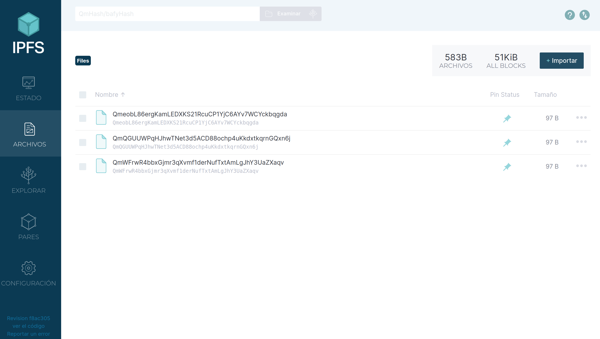
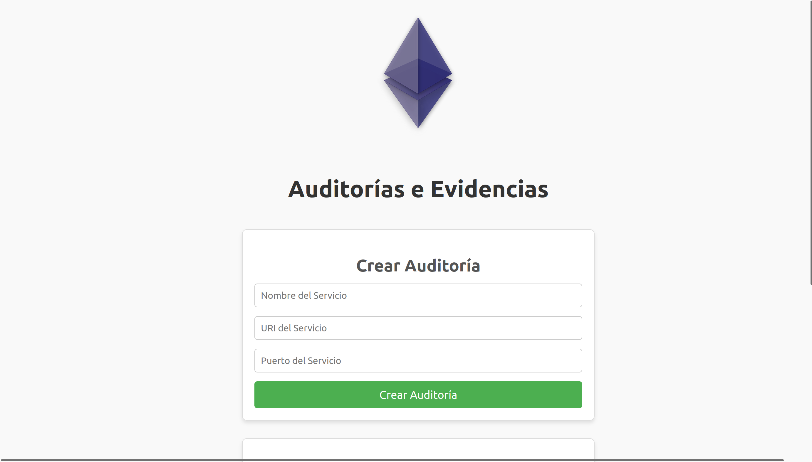
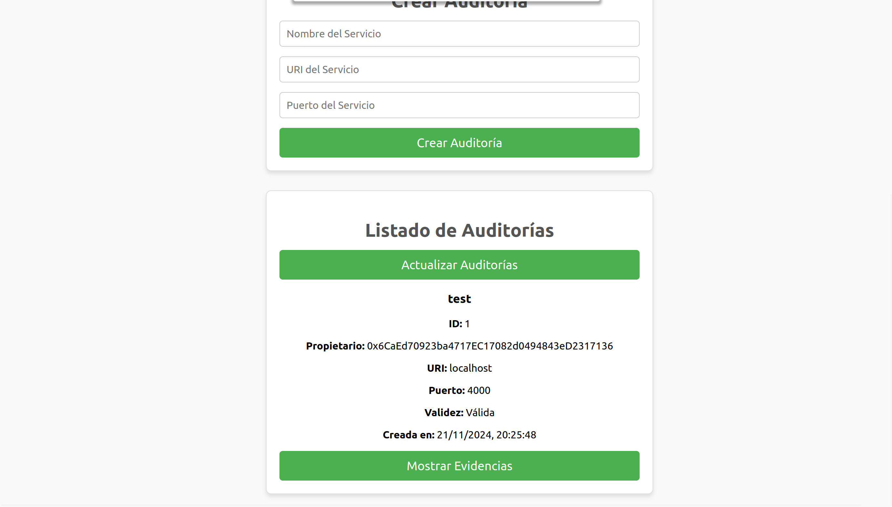
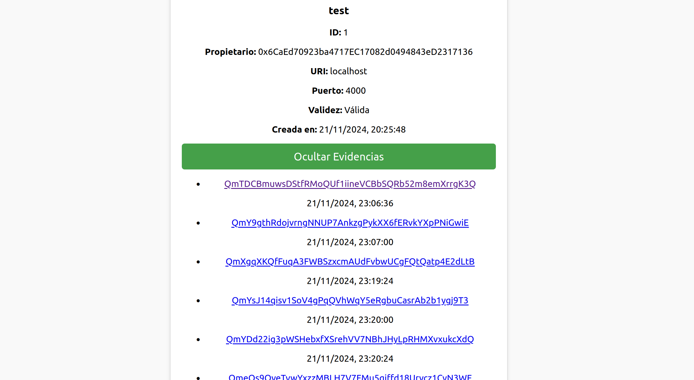

# Entrega Laboratorio 2

**Tecnologías de registro distribuido en BlockChain
Edgar Vargas // Juan Martin**

Prácticas (en grupo)

## Ejercicio 1 [0.2 punto]:

Realiza los pasos indicados en la sección 3: sube un fichero a IPFS y comprueba que las transacciones se han realizado correctamente.

## Ejercicio 2 [0.8 punto]

Define un caso de uso similar al explicado en la sección 2 e impleméntalo partiendo del código del ejercicio 1. Documenta el caso de uso de forma similar a la sección 2.
Incluye una sección de lecciones aprendidas comentando los problemas/incidencias que tuviste durante la realización de la práctica.

## 1. Caso de uso.

Sistema de Auditoria de seguridad para proveedores de servicios. Nombre del proyecto **SOFOS**

### Resumen del Proyecto

Este proyecto tiene como objetivo desarrollar una prueba de concepto para un sistema de auditoría de seguridad utilizando la blockchain de Ethereum. La solución garantizará la integridad, la trazabilidad y la transparencia de las auditorías realizadas a equipos informáticos. Para ello, se utilizará un contrato inteligente conectado a un oráculo respaldado por tecnologías como MongoDB, Node.js, Docker e IPFS.

### Introducción

En un mundo donde la seguridad informática es crítica, contar con auditorías fiables y transparentes es indispensable para prevenir vulnerabilidades en los sistemas y aportar confianza a tus usuarios y clientes. Sin embargo, los métodos tradicionales de auditoría enfrentan problemas como la falta de trazabilidad, la manipulación de datos y la dependencia de sistemas centralizados.
Este proyecto propone una solución innovadora mediante el uso de la blockchain de Ethereum para registrar las auditorías, asegurando la inmutabilidad de los datos, con un oráculo que facilita la integración de la información externa.

### Contexto

1. **Problemática Actual**:
    - Las auditorías de seguridad son vulnerables a la manipulación de datos por parte de usuarios malintencionados.
    - Falta de un sistema confiable para verificar que los resultados de auditoría no hayan sido alterados.
2. **Solución Propuesta**:
    - Uso de contratos inteligentes para registrar los hashes de auditorías en la blockchain de Ethereum.
    - Implementación de un oráculo para procesar y almacenar datos de auditoría en MongoDB e IPFS.
    - Integración de direcciones Ethereum como identificadores únicos para garantizar autenticación segura.

### Objetivo

Crear un sistema confiable que permita realizar auditorías de seguridad a equipos informáticos y almacenar los resultados en una blockchain para garantizar que los datos sean inmutables y verificables.

### Función Principal

Permitir a los usuarios y proveedores de servicios realizar, consultar y verificar auditorías de seguridad, generadas por una entidad independiente, sin la posibilidad de modificar o eliminar la información almacenada.

### Tecnología Clave

- Blockchain de Ethereum: Garantiza la integridad y la trazabilidad de los datos de auditoría.
- Oráculo: Conecta la blockchain con sistemas externos para procesar y almacenar los resultados de auditorías en una base de datos y en IPFS.
- MongoDB: Actúa como una base de datos de caché para acelerar las consultas.
- IPFS: Permite el almacenamiento distribuido y seguro de los archivos de auditoría.
- Docker: Facilita la gestión y el despliegue de contenedores para los diferentes componentes del sistema.

### **Entidades Principales**

1. **Usuarios**: Entidades que solicitan auditorías de seguridad.
2. **Proveedores de Auditorías**: Empresas o individuos que realizan las auditorías.
3. **Contrato Inteligente**: Gestiona las transacciones relacionadas con auditorías y certificaciones.
4. **Oráculo**: Conecta la blockchain con sistemas externos para realizar y almacenar auditorías.
5. **IPFS (InterPlanetary File System)**: Sistema para almacenamiento distribuido de resultados.

### **Características de las auditorias**

Cada certificado de auditoría incluye:

1. **ID:** Identificador único generado automáticamente para cada auditoría, que sirve como referencia principal en el sistema
2. **URL de la maquina:** Dirección IP o URL del sistema que se está auditando, permitiendo identificar de manera única el equipo o servicio que fue objeto de la evaluación de seguridad.
3. **Puerto**: Número del puerto TCP/IP que se está auditando en el sistema objetivo, lo que permite identificar específicamente qué servicios o aplicaciones están siendo evaluados en términos de seguridad.
4. **Estado del Sistema**: Indica el estado actual del sistema que se está auditando.
5. **Timestamp**: Marca temporal que indica cuándo se realizó creo la auditoría.
6. **Evidencias**: Hash y timestamp del documento en IPFS, sirve como prueba inmutable de la auditoría.

**Proceso de Acceso**

1. **Solicitud de Auditoría**:
    - El usuario solicita una auditoría proporcionando los detalles del equipo.
    - La solicitud se registra en la blockchain.
2. **Ejecución de Auditoría**:
    - El oráculo realiza la auditoría y genera un reporte.
    - El reporte se guarda en IPFS y se registra su hash en el contrato inteligente.
3. **Verificación**:
    - Los usuarios pueden verificar el certificado accediendo al hash en la blockchain y comparándolo con el archivo en IPFS.

**Requisitos para el Funcionamiento**

1. **Infraestructura**:
    - Un nodo de Ethereum para desplegar y ejecutar el contrato inteligente.
    - Un servicio de MongoDB para caché de datos.
    - Docker para gestionar el almacenamiento en IPFS.
2. **Componentes Clave**:
    - Contrato inteligente en Solidity para gestionar las auditorías.
    - Oráculo en Node.js para procesar datos externos.
    - Scripts de integración entre MongoDB, IPFS y la blockchain.

## **2. Implementación de la Arquitectura propuesta:**

1. **Contrato Inteligente (Solidity)**:
    1. Desarrollado para Ethereum, almacena las adutorias y los hashes de los reportes generados por el Oraculo.
    2. Provee autenticación mediante direcciones Ethereum.
    3. Ofrece funciones para consultar y registrar auditorías.
2. **Oráculo (Node.js)**:
    1. Al iniciarse recupera todas las auditorías del contrato inteligente y las almacena en una base de datos MongoDB para tener un acceso más rápido.
    2. Inicia un proceso cíclico de ejecución, donde procesa cada una de las auditorías almacenadas en intervalos de tiempo específicos.
    3. Por cada auditoría genera un reporte que almacena en IPFS y envía el hash de IPFS al contrato inteligente.
    4. Cuando se crea una nueva auditoría en el contrato inteligente, el oráculo, que está suscrito al evento de creación de auditorías del contrato, consulta los datos y los almacena en MongoDB para incluirlos en la lista de auditorías.
    5. Para comunicarse con ethereum lo hacemos mediante el proveedor de servicios alchemy.
3. **MongoDB**:
    1. Actúa como base de datos de caché para almacenar las auditorias y tener un acceso mas rapido a las mismas.
4. **IPFS** 
    1. Almacena los archivos de auditoría de forma distribuida y descentralizada, garantizando la disponibilidad e integridad de los datos.
    2. Genera un identificador único (CID) para cada archivo almacenado, que se utiliza como referencia en el contrato inteligente.
    
    <aside>
    
    En esta captura de pantalla podemos ver las evidencias creadas en IPFS
    
    </aside>
    
    
    
5. **Front-end (Aplicación Web)**:
    1. Desarrollada para que los usuarios soliciten y consulten auditorías.
    2. Se comunica con el contrato inteligente a través de una API compatible con Ethereum (Web3.js).
    
    <aside>

    En esta captura de pantalla podemos ver ejemplo del frontend
    
    </aside>
    
    
    
    
    
    
    
6. Docker y Docker-compose
    1. Se utiliza Docker y Docker-compose para facilitar el despliegue y la gestión de todos los componentes del sistema, incluyendo el oráculo, MongoDB e IPFS.
    2. Los contenedores se configuran y orquestan mediante archivos docker-compose.yml, permitiendo un despliegue consistente y reproducible en diferentes entornos.
7. Maquina de pruebas:
    1. Se ha añadido una maquina de pruebas que se depliega en el puerto 4000 para que sirva como maquina de pruebas para las primeras auditorias en este prototipo.

## 3. Depliegue del sistema

Para desplegar el sistema, se deben seguir los siguientes pasos de configuración:

1. **Configuración del archivo .env:**
    - Dentro del directorio 'oraculo', crear un archivo .env
    - Añadir la variable PRIVATE_KEY con la clave privada de Ethereum que utilizará el oráculo
2. **Configuración de Alchemy:**
    - Crear una cuenta en Alchemy
    - Obtener una API key
    - Modificar el código del oráculo para incluir la API key de Alchemy
3. **Configuración del contrato:**
    - Si se utiliza un nuevo contrato inteligente, desplegarlo en la red Ethereum
    - Actualizar el ABI y la dirección del contrato tanto en el frontend como en el oráculo

Una vez realizadas todas estas configuraciones, el sistema puede desplegarse ejecutando:

```bash
docker compose up
```

Esto iniciará todos los servicios necesarios (oráculo, MongoDB, IPFS y frontend) en sus respectivos contenedores.


Tiempo dedicado aproximado: 20 horas.